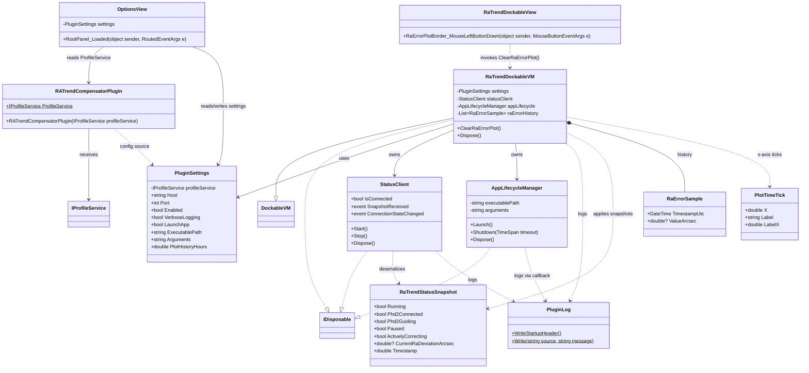

# RA Trend Compensator NINA Plugin - Class Diagram

```mermaid
classDiagram
	class RATrendCompensatorPlugin {
		+IProfileService ProfileService$
		+RATrendCompensatorPlugin(IProfileService profileService)
	}

	class PluginSettings {
		-IProfileService profileService
		+string Host
		+int Port
		+bool Enabled
		+bool VerboseLogging
		+bool LaunchApp
		+string ExecutablePath
		+string Arguments
		+double PlotHistoryHours
	}

	class RaTrendDockableVM {
		-PluginSettings settings
		-StatusClient statusClient
		-AppLifecycleManager appLifecycle
		-List~RaErrorSample~ raErrorHistory
		+ClearRaErrorPlot()
		+Dispose()
	}

	class StatusClient {
		+bool IsConnected
		+event SnapshotReceived
		+event ConnectionStateChanged
		+Start()
		+Stop()
		+Dispose()
	}

	class AppLifecycleManager {
		-string executablePath
		-string arguments
		+Launch()
		+Shutdown(TimeSpan timeout)
		+Dispose()
	}

	class RaTrendStatusSnapshot {
		+bool Running
		+bool Phd2Connected
		+bool Phd2Guiding
		+bool Paused
		+bool ActivelyCorrecting
		+double? CurrentRaDeviationArcsec
		+double Timestamp
	}

	class PluginLog {
		+WriteStartupHeader()$
		+Write(string source, string message)$
	}

	class OptionsView {
		-PluginSettings settings
		+RootPanel_Loaded(object sender, RoutedEventArgs e)
	}

	class RaTrendDockableView {
		+RaErrorPlotBorder_MouseLeftButtonDown(object sender, MouseButtonEventArgs e)
	}

	class RaErrorSample {
		+DateTime TimestampUtc
		+double? ValueArcsec
	}

	class PlotTimeTick {
		+double X
		+string Label
		+double LabelX
	}

	class DockableVM
	class IProfileService
	class IDisposable

	RATrendCompensatorPlugin --> IProfileService : receives
	RATrendCompensatorPlugin ..> PluginSettings : config source

	OptionsView --> RATrendCompensatorPlugin : reads ProfileService
	OptionsView --> PluginSettings : reads/writes settings

	RaTrendDockableVM --|> DockableVM
	RaTrendDockableVM ..|> IDisposable
	RaTrendDockableVM --> PluginSettings : uses
	RaTrendDockableVM --> StatusClient : owns
	RaTrendDockableVM --> AppLifecycleManager : owns
	RaTrendDockableVM ..> PluginLog : logs
	RaTrendDockableVM ..> RaTrendStatusSnapshot : applies snapshots
	RaTrendDockableVM *-- RaErrorSample : history
	RaTrendDockableVM ..> PlotTimeTick : x-axis ticks

	StatusClient ..|> IDisposable
	StatusClient ..> RaTrendStatusSnapshot : deserializes
	StatusClient ..> PluginLog : logs

	AppLifecycleManager ..|> IDisposable
	AppLifecycleManager ..> PluginLog : logs via callback

	RaTrendDockableView ..> RaTrendDockableVM : invokes ClearRaErrorPlot()
```
